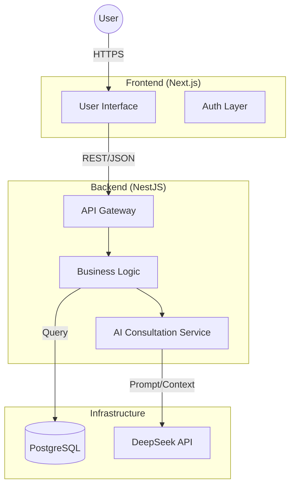

# 📍 Mr. Can's Tyres Shop – Digital Platform


[](https://www.typescriptlang.org)
[](https://nextjs.org)
[](https://nestjs.com)
[](https://www.postgresql.org)
[](https://deepseek.com)
[](LICENSE)

> **A modern monorepo solution bridging local craftsmanship with digital accessibility.**
>
> _The official digital storefront and AI consultation engine for Mr. Can's Tyres Shop in Nha Trang, Vietnam._

[View Demo](https://canstyres.vercel.app) • [Report Bug](mailto:dinhnhatbao.work@gmail.com) • [Request Feature](mailto:dinhnhatbao.work@gmail.com)

---

## 📖 Table of Contents

- [📍 Project Overview](#-project-overview)
- [🛠 Tech Stack & Architecture](#-tech-stack--architecture)
- [📂 Project Structure](#-project-structure)
- [🚀 Getting Started](#-getting-started)
- [⚙️ Configuration](#️-configuration)
- [🌱 Roadmap](#-roadmap)
- [🤝 Contributing](#-contributing)
- [📄 License](#-license)
- [📢 Advertisement](#-advertisement)

---

## 📍 Project Overview

**Mr. Can's Tyres Shop** is a trusted local scooter and motorbike repair service specializing in tyre repair, replacement, and general maintenance.

This platform serves as a **Digital Service Hub**. It combines high-performance web standards for discoverability with practical utility. The core innovation is an **AI Assistant** that provides instant, safe, and accurate maintenance advice based on the shop's specific inventory and pricing, bridging the language barrier for tourists and expats in Nha Trang.

### 🎯 Target Users

- **Tourists** renting scooters in Nha Trang
- **Expats** unfamiliar with local repair pricing
- **Local shop owners** seeking digital transformation

### ✨ Key Features

#### 🌏 **Multi-language Support**

- Native support for **Vietnamese 🇻🇳, English 🇺🇸, and Russian 🇷🇺**, tailored for Nha Trang’s international tourist base.
- **SEO Optimized:** Server-side rendering (SSR) and structured metadata ensure high visibility on Google Maps and local search results.

#### 📄 **Product & Service Information**

- **Service Catalog:** Clear categorization of services such as **Tyres, Engine Oil, Battery, Brakes, and CVT maintenance**.
- **Transparent Pricing:** Estimated price ranges displayed upfront to build trust and avoid surprises.
- **Vehicle Compatibility:** Service details adapted by vehicle type (e.g. Vision, Air Blade, SH).
- **Brand Visibility:** Highlighted tyre and parts brands (Dunlop, Michelin, Maxxis) to reinforce quality assurance.
- **Real-world Guidance:** Practical explanations instead of technical jargon, optimized for non-local customers.

#### 🤖 **AI Consultation**

- **Context-Aware Responses:** AI is trained on **Mr. Can’s real inventory, service workflow, and pricing logic**.
- **Instant Triage:** Users can describe issues like _“My tyre is flat”_ or _“My brakes are squeaking”_ and receive:
  - Probable cause
  - Recommended service
  - Estimated cost range
- **Tourist-Friendly:** Explains problems in simple language and advises whether the issue is safe to ride or requires immediate attention.
- **Human Handoff Ready:** When needed, the AI seamlessly escalates to direct contact via **Zalo or phone**.

> [!WARNING]
> **Disclaimer:** The AI assistant provides preliminary guidance only and does not replace professional mechanical inspection.

---

## 🛠 Tech Stack & Architecture

This project utilizes a modern **Monorepo** structure.



### 🏗 Application Layer

| Domain       | Technology       | Description                                                                                                      |
| :----------- | :--------------- | :--------------------------------------------------------------------------------------------------------------- |
| **Frontend** | **Next.js**      | App Router, React Server Components, Tailwind CSS, Framer Motion.                                                |
| **Backend**  | **NestJS**       | Modular Architecture, Zod Validation, Swagger API (Docs at `/docs`), Helmet Security.                            |
| **AI / LLM** | **DeepSeek API** | Cost-efficient LLM with strong multilingual support. Custom prompt engineering with inventory context injection. |

### 🗄 Infrastructure & Data

| Domain       | Technology         | Description                                               |
| :----------- | :----------------- | :-------------------------------------------------------- |
| **Database** | **PostgreSQL**     | Relational data for Products, Services, and Logs.         |
| **ORM**      | **Prisma**         | Type-safe database access and schema migration.           |
| **DevOps**   | **Docker**         | Multi-stage builds for lightweight production images.     |
| **CI/CD**    | **GitHub Actions** | Automated linting, type-checking, and build verification. |

---

## 📂 Project Structure

> 🚧 **Note:** The directory structure below represents the **target architecture** currently being implemented.

```bash
├── apps/
│   ├── client/           # Next.js (Frontend User Interface)
│   └── server/           # NestJS (Backend API)
│
├── packages/
│   ├── config/           # Shared configurations (ESLint, Prettier, TSConfig)
│   └── types/            # Shared DTOs, Interfaces & Zod Schemas
│
├── infra/
│   └── docker/           # Docker Compose & Dockerfiles
│
├── .github/
│   └── workflows/        # CI/CD pipelines
│
├── .gitignore
├── LICENSE
└── README.md
```

---

## 🚀 Getting Started

Follow these steps to set up the project locally.

### Prerequisites

- **Node.js**
- **Docker & Docker Compose**
- **npm**

### Installation

1. **Clone the repository**

   ```bash
   git clone https://github.com/kasperdinh/mr-cans-tyres-shop.git
   cd mr-cans-tyres-shop
   ```

2. **Install pnpm** (if not already installed)

   ```bash
   npm install -g pnpm
   ```

3. **Install dependencies**

   ```bash
   pnpm install
   ```

4. **Environment Setup**
   Duplicate the `.env.example` file in both `apps/client` and `apps/server`.

   ```bash
   cp apps/server/.env.example apps/server/.env
   # Update database credentials and API keys
   ```

5. **Spin up Infrastructure**
   Start the PostgreSQL container:

   ```bash
   docker-compose up -d db
   ```

6. **Run Migrations**

   ```bash
   cd apps/server && npx prisma migrate dev
   ```

   ```

   ```

7. **Start Development Servers**
   ```bash
   pnpm dev
   ```
   > **Note:** The server API is available at `http://localhost:3000/api` and Swagger Docs at `http://localhost:3000/docs`.

---

## ⚙️ Configuration

Key environment variables to configure in your `.env` files.

### Server (`apps/server/.env`)

| Variable           | Description                          |
| :----------------- | :----------------------------------- |
| `DATABASE_URL`     | PostgreSQL connection string         |
| `DEEPSEEK_API_KEY` | API Key for AI Consultation features |
| `PORT`             | API Port (Default: 3000)             |

### Client (`apps/client/.env.local`)

| Variable                   | Description                    |
| :------------------------- | :----------------------------- |
| `NEXT_PUBLIC_API_URL`      | URL of the NestJS Backend      |
| `NEXT_PUBLIC_ANALYTICS_ID` | Google Analytics ID (Optional) |

---

## 🌱 Roadmap

> ✅ **Current Status:** Phase 2: Backend Core (The Engine) ⚙️

- [x] **Phase 1: Foundation & Infrastructure 🏗️**
  - [x] Initialize Monorepo (TurboRepo)
  - [x] **Type Safety:** Shared DTOs & Interfaces package
  - [x] **Code Quality:** ESLint, Prettier, and Husky (Commit hooks)
  - [x] **Env Management:** Zod validation for Environment Variables
  - [x] Docker & Docker Compose environment (Postgres, Redis)
  - [x] CI/CD Pipeline Setup (GitHub Actions)

- [ ] **Phase 2: Backend Core (The Engine) ⚙️**
  - [x] NestJS Application Setup (Global Validation, Swagger, Helmet)
  - [ ] **AI-Ready Schema:** Postgres Schema with structured descriptions & constraints
  - [ ] **Secure Auth:** Role-based System (Admin/User) via JWT/OAuth
  - [ ] Product & Service Catalog API (CRUD)
  - [ ] **Data Integrity:** Audit Logging & Pricing History

- [ ] **Phase 3: Frontend Experience (The Showroom) 🏪**
  - [ ] Next.js App Router Setup
  - [ ] Homepage & Landing Page (Hero, Advertisement)
  - [ ] Service Catalog UI (Filtering, Search)
  - [ ] **i18n Stage 1:** Core Languages (English 🇺🇸, Vietnamese 🇻🇳)
  - [ ] **i18n Stage 2:** Extended Support (Russian 🇷🇺)

- [ ] **Phase 4: AI Consultation (The Brain) 🧠**
  - [ ] DeepSeek API Integration with Context Injection
  - [ ] **Hybrid Safety Engine:** LLM Reasoning + Deterministic Rule Validation
  - [ ] Chat Interface (Streaming w/ Markdown support)
  - [ ] **Safety Layer:** Explicit Disclaimers & Edge Case Handling

- [ ] **Phase 5: Operations & Observability 🛡️**
  - [ ] **Monitoring:** Centralized Logging (Sentry/OpenTelemetry)
  - [ ] **Feedback Loop:** AI Response Rating System
  - [ ] Admin Dashboard (Manage Inventory, Update Prices)

- [ ] **Phase 6: Launch & Optimization 🚀**
  - [ ] Production Deployment (Vercel + Railway/VPS)
  - [ ] SEO Tuning & Metadata (OpenGraph, Schema.org)
  - [ ] Performance Testing (Core Web Vitals / Lighthouse)
  - [ ] User Acceptance Testing

---

## 🤝 Contributing

Contributions are welcome! Please follow these steps:

1. Fork the repository.
2. Create your feature branch (`git checkout -b feature/AmazingFeature`).
3. Commit your changes (`git commit -m 'Add some AmazingFeature'`).
4. Push to the branch (`git push origin feature/AmazingFeature`).
5. Open a Pull Request.

Please ensure your code follows the established coding standards and includes appropriate tests.

---

## 📄 License

Distributed under the **MIT License**. See [LICENSE](LICENSE) for more information.

---

## 📢 Advertisement ^^

If you are in Nha Trang City and need help with your bike, come visit us!

- **Business Name:** Mr. Can's Tyres Shop
- **Address:** [325, 2/4 Street, Nha Trang, Vietnam](https://www.google.com/search?q=https://maps.google.com/%3Fq%3D325%2B2/4%2BStreet%2BNha%2BTrang)
- **Phone:** [+84 377 149 693](https://www.google.com/search?q=tel:%2B84377149693)
- **Social:** [Zalo Chat](https://zalo.me/0377149693) | [WhatsApp Chat](https://wa.me/84377149693)
